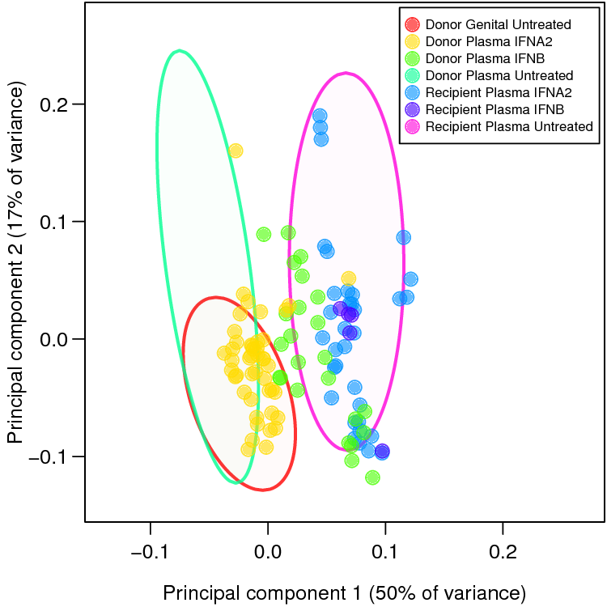
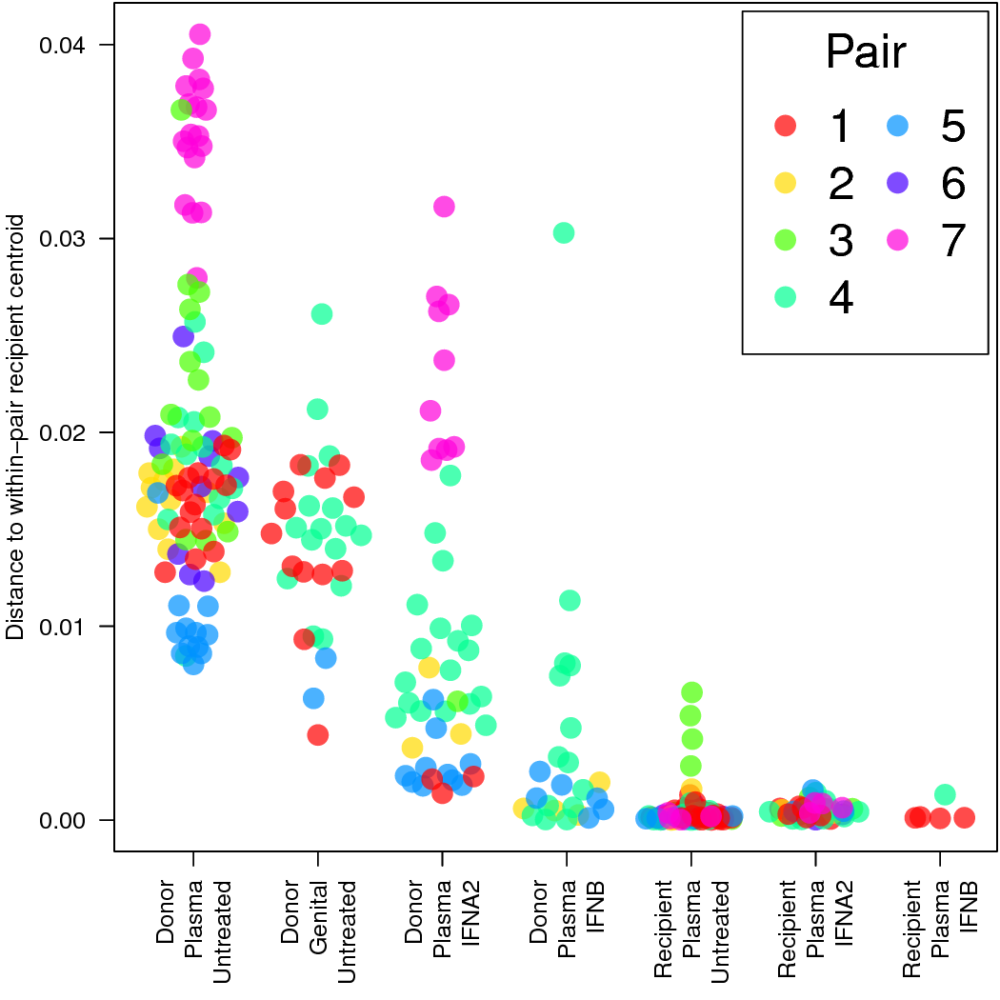
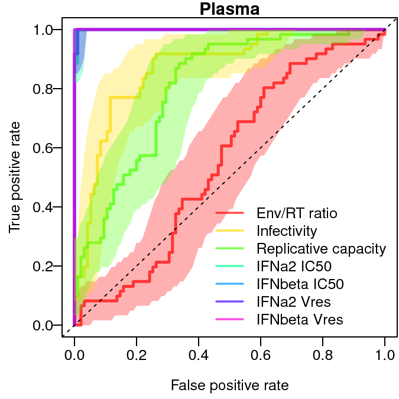
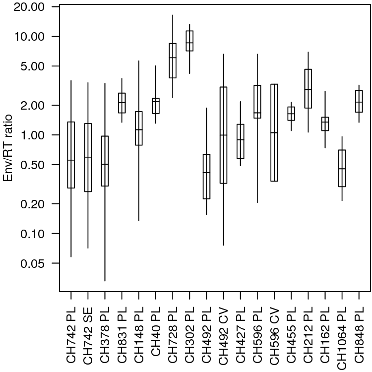
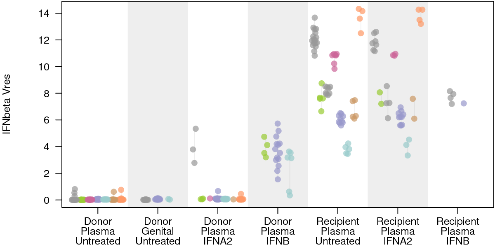

# Code for the paper "Resistance to type 1 interferons is a major determinant of HIV-1 transmission fitness"

## Data
The data used in the paper is in [`data/Iyer2016_Data.csv`](data/Iyer2016_Data.csv). All columns are as described in the paper. The "Censored IFNbeta Vres" is TRUE where the measurement of IFNbeta Vres was lower than the limit of detection and so the unobserved true measurement should be less than or equal the value in the "IFNbeta Vres" column.

## Necessary packages
The code uses several packages. If you'd like to install them all in one shot, you can do:

    install.packages(c('cluster','rstan','vioplot','png','vipor','ROCR','pROC'))

The code also uses the `parallel` package but that is included in base R and should not require installation. Versions used in the paper were:

Package|Version
-------|---------
cluster|2.0.4
rstan|2.13.2
vioplot|0.2
png|0.1-7
vipor|0.4.4
ROCR|1.0-7
pROC|1.8
R|3.3.1

## Generating all plots
To generate all plots:
 1. clone/download the repository 
 2. start R with its working directory in the repository directory
 3. in R, run the command: `source('runAll.R')`

This will generate PCA, ROC, box and whisker and Bayesian plots in the `out` directory. Calculations may take 20-60 minutes. The number of Bayesian simulations have been turned down from that used for the paper for computational simplicity.

The generated plots were tweaked, without altering the underlying data, for clarity and presentation prior to inclusion in the paper.

## Example plots
Plot output should resemble:

### PCA

### Centroid distance

### ROC

### Box and whisker

### Seven line point plot

### Bayesian
Note that stochastic sampling is used to estimate the posterior probabilities so the plots from each run will be slightly different. Also the final figures for the paper were generated using additional iterations to produce smoother estimates.

.png)

